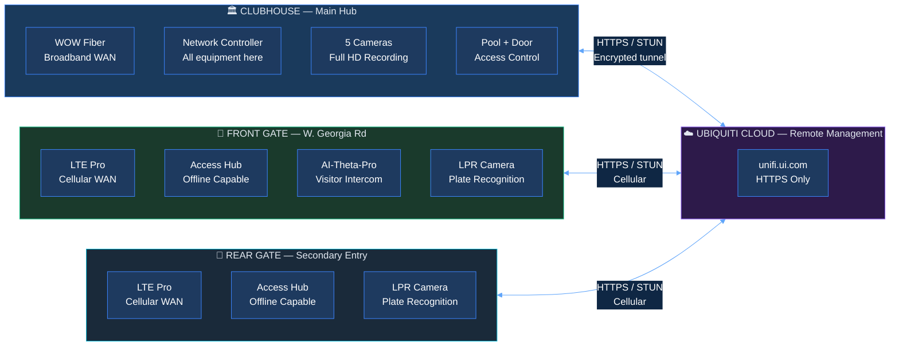
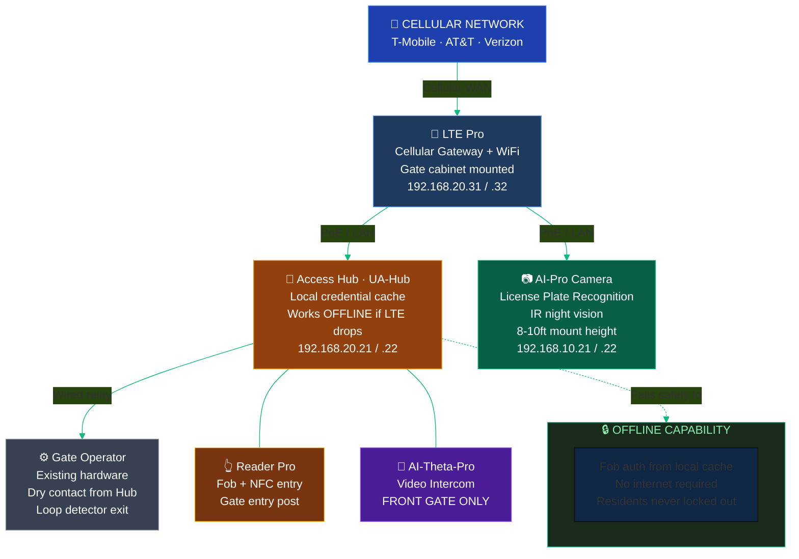
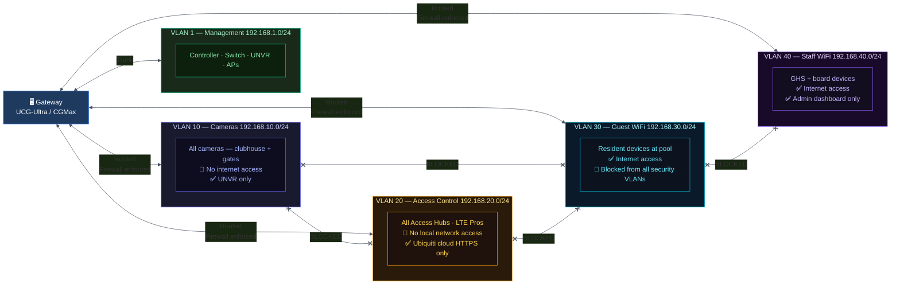
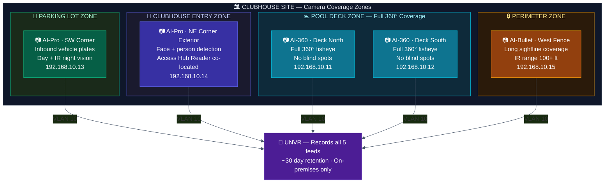
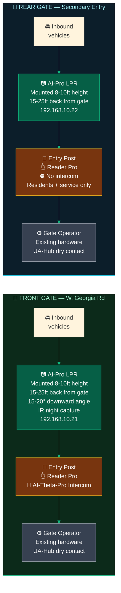
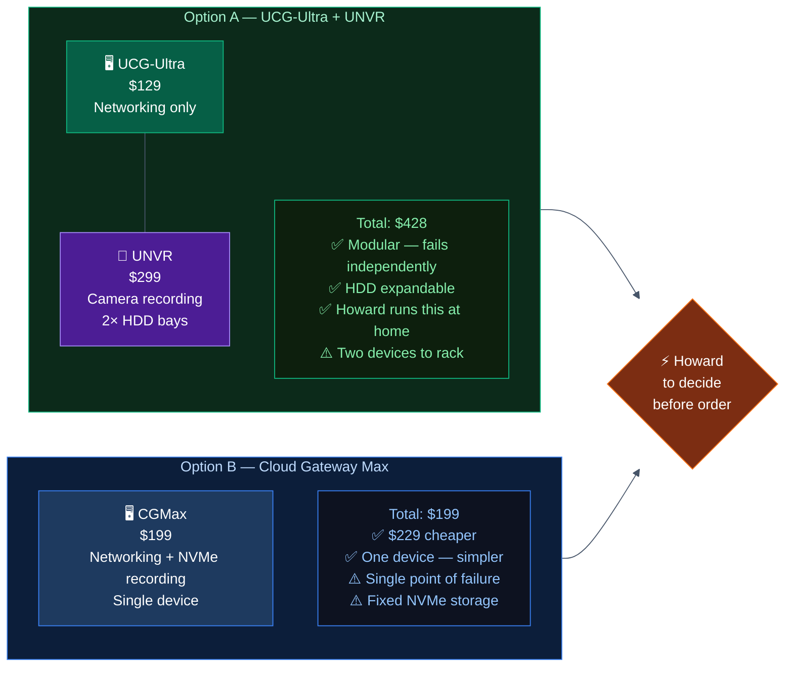
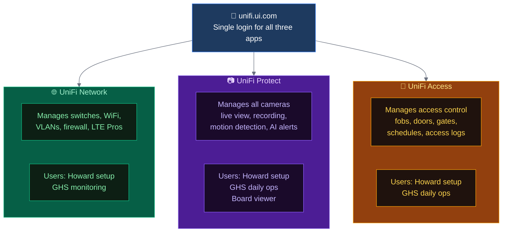

# Project ARGUS — Network Architecture
## River Shoals HOA | Infrastructure Design Reference

*Last updated: June 2026 | Owner: Howard Rapp*

---

## 1. Site Overview

River Shoals HOA has three distinct physical locations that make up the ARGUS security infrastructure.



| Site | Distance | Connectivity | Power |
|---|---|---|---|
| Clubhouse | Central hub | WOW fiber broadband | Existing AC |
| Front Gate (W. Georgia Rd) | ~1 mile from clubhouse | LTE Pro cellular | Existing AC |
| Rear Gate | ~1 mile from clubhouse | LTE Pro cellular | Existing AC |

---

## 2. Clubhouse Network — Physical Topology

```mermaid
%%{init: {'theme': 'base', 'themeVariables': {'primaryColor': '#0f2744', 'primaryTextColor': '#ffffff', 'primaryBorderColor': '#3b82f6', 'lineColor': '#60a5fa', 'background': '#0a1628'}}}%%
graph TD
    WOW["🌐 WOW FIBER\nBroadband WAN"]
    UCG["🖥️ UCG-Ultra or CGMax\nGateway · Controller · Firewall\n192.168.1.1"]
    SW["⚡ USW-Lite-8-POE\nManaged PoE Switch\n192.168.1.20"]
    UNVR["💾 UNVR\nCamera Recorder\n2 × 4TB HDD · ~30 day retention\n192.168.1.10"]
    CAM360A["📷 AI-360 · Pool Deck North\n192.168.10.11"]
    CAM360B["📷 AI-360 · Pool Deck South\n192.168.10.12"]
    CAMPRO1["📷 AI-Pro · Parking Lot\n192.168.10.13"]
    CAMPRO2["📷 AI-Pro · Clubhouse Door\n192.168.10.14"]
    CAMBULLET["📷 AI-Bullet · Perimeter Fence\n192.168.10.15"]
    AP1["📶 U6 Mesh · Pool Area\n192.168.1.31"]
    AP2["📶 U6 Mesh · Patio\n192.168.1.32"]
    AP3["📶 U6 Extender\n192.168.1.33"]
    HUB1["🔑 Access Hub · Pool Gate\n192.168.20.11"]
    HUB2["🔑 Access Hub · Clubhouse Door\n192.168.20.12"]
    READER1["👆 Reader Pro · Pool Entry"]
    READER2["👆 Reader Lite · Pool Exit"]
    READER3["👆 Reader Pro · Clubhouse Door"]
    MAGLOCK["🔒 Maglock\nContractor Install"]

    WOW -->|WAN| UCG
    UCG -->|LAN trunk| SW
    SW -->|PoE| UNVR
    SW -->|PoE VLAN 10| CAM360A
    SW -->|PoE VLAN 10| CAM360B
    SW -->|PoE VLAN 10| CAMPRO1
    SW -->|PoE VLAN 10| CAMPRO2
    SW -->|PoE VLAN 10| CAMBULLET
    SW -->|PoE VLAN 40/30| AP1
    SW -->|PoE VLAN 40/30| AP2
    SW -->|PoE VLAN 40/30| AP3
    SW -->|PoE VLAN 20| HUB1
    SW -->|PoE VLAN 20| HUB2
    HUB1 --- READER1
    HUB1 --- READER2
    HUB2 --- READER3
    HUB2 --- MAGLOCK
    UNVR <-->|Records footage| CAM360A
    UNVR <-->|Records footage| CAM360B
    UNVR <-->|Records footage| CAMPRO1
    UNVR <-->|Records footage| CAMPRO2
    UNVR <-->|Records footage| CAMBULLET

    style WOW fill:#1e40af,stroke:#3b82f6,color:#fff
    style UCG fill:#1e3a5f,stroke:#60a5fa,color:#fff
    style SW fill:#1e3a5f,stroke:#60a5fa,color:#fff
    style UNVR fill:#7c3aed,stroke:#a78bfa,color:#fff
    style CAM360A fill:#065f46,stroke:#10b981,color:#fff
    style CAM360B fill:#065f46,stroke:#10b981,color:#fff
    style CAMPRO1 fill:#065f46,stroke:#10b981,color:#fff
    style CAMPRO2 fill:#065f46,stroke:#10b981,color:#fff
    style CAMBULLET fill:#065f46,stroke:#10b981,color:#fff
    style AP1 fill:#0e7490,stroke:#06b6d4,color:#fff
    style AP2 fill:#0e7490,stroke:#06b6d4,color:#fff
    style AP3 fill:#0e7490,stroke:#06b6d4,color:#fff
    style HUB1 fill:#92400e,stroke:#f59e0b,color:#fff
    style HUB2 fill:#92400e,stroke:#f59e0b,color:#fff
    style READER1 fill:#78350f,stroke:#fbbf24,color:#fff
    style READER2 fill:#78350f,stroke:#fbbf24,color:#fff
    style READER3 fill:#78350f,stroke:#fbbf24,color:#fff
    style MAGLOCK fill:#7f1d1d,stroke:#ef4444,color:#fff
```



> **CGMax note:** If CGMax is chosen over UCG-Ultra + UNVR, the two top boxes collapse into one device. All downstream connections remain identical.

---

## 3. Gate Network — Physical Topology

Both gates use an identical architecture. This diagram applies to both the front and rear gate.



**Front gate only:** AI-Theta-Pro video intercom installed. Rear gate has Reader Pro and LPR camera only — no intercom, residents and service vehicles with fobs only.

---

## 4. Full System Logical Topology — All Three Sites

```mermaid
%%{init: {'theme': 'base', 'themeVariables': {'primaryColor': '#111827', 'lineColor': '#6b7280'}}}%%
graph TB
    subgraph INTERNET["☁️  INTERNET & UBIQUITI CLOUD"]
        WOW2["WOW Fiber"]
        LTE_CELL["Cellular Networks"]
        CLOUD2["Ubiquiti Cloud\nunifi.ui.com\nHTTPS only · No footage stored"]
    end

    subgraph CLUBHOUSE2["🏛️  CLUBHOUSE"]
        UCG2["UCG-Ultra / CGMax\nGateway + Controller"]
        SW2["PoE Switch"]
        UNVR2["UNVR\nOn-premises recording"]
        CAMS2["5 Cameras\nAI-360 × 2\nAI-Pro × 2\nAI-Bullet × 1"]
        APS2["WiFi APs × 3"]
        HUBS2["Access Hubs × 2\nPool + Door"]
    end

    subgraph FGATE2["🚗  FRONT GATE"]
        LTEF["LTE Pro"]
        HUBF["Access Hub\nw/ Credential Cache"]
        INTERCOMF["AI-Theta-Pro\nIntercom"]
        CAMF["AI-Pro LPR\nCamera"]
        READF["Reader Pro"]
    end

    subgraph RGATE2["🚗  REAR GATE"]
        LTER["LTE Pro"]
        HUBR["Access Hub\nw/ Credential Cache"]
        CAMR["AI-Pro LPR\nCamera"]
        READR["Reader Pro"]
    end

    WOW2 -->|WAN| UCG2
    UCG2 --> SW2
    SW2 --> UNVR2
    SW2 --> CAMS2
    SW2 --> APS2
    SW2 --> HUBS2
    UNVR2 <--> CAMS2

    LTE_CELL --> LTEF
    LTE_CELL --> LTER
    LTEF --> HUBF
    LTEF --> CAMF
    HUBF --- INTERCOMF
    HUBF --- READF
    LTER --> HUBR
    LTER --> CAMR
    HUBR ---READR

    CLOUD2 <-->|"HTTPS management"| UCG2
    CLOUD2 <-->|"HTTPS management"| LTEF
    CLOUD2 <-->|"HTTPS management"| LTER

    style INTERNET fill:#1e1b4b,stroke:#818cf8,color:#e0e7ff
    style CLUBHOUSE2 fill:#0c2340,stroke:#3b82f6,color:#bfdbfe
    style FGATE2 fill:#0c2a1a,stroke:#10b981,color:#a7f3d0
    style RGATE2 fill:#0c1e2a,stroke:#06b6d4,color:#a5f3fc
    style UCG2 fill:#1e3a5f,stroke:#60a5fa,color:#fff
    style SW2 fill:#1e3a5f,stroke:#60a5fa,color:#fff
    style UNVR2 fill:#4c1d95,stroke:#a78bfa,color:#fff
    style CAMS2 fill:#065f46,stroke:#10b981,color:#fff
    style APS2 fill:#0e7490,stroke:#06b6d4,color:#fff
    style HUBS2 fill:#92400e,stroke:#f59e0b,color:#fff
    style LTEF fill:#1e3a5f,stroke:#60a5fa,color:#fff
    style LTER fill:#1e3a5f,stroke:#60a5fa,color:#fff
    style HUBF fill:#92400e,stroke:#f59e0b,color:#fff
    style HUBR fill:#92400e,stroke:#f59e0b,color:#fff
    style INTERCOMF fill:#4a1d96,stroke:#8b5cf6,color:#fff
    style CAMF fill:#065f46,stroke:#10b981,color:#fff
    style CAMR fill:#065f46,stroke:#10b981,color:#fff
    style READF fill:#78350f,stroke:#fbbf24,color:#fff
    styleREADR fill:#78350f,stroke:#fbbf24,color:#fff
    style CLOUD2 fill:#2d1a4a,stroke:#8b5cf6,color:#e9d5ff
    style WOW2 fill:#1e40af,stroke:#3b82f6,color:#fff
    style LTE_CELL fill:#1e40af,stroke:#3b82f6,color:#fff
```

---

## 5. VLAN Segmentation Design

Each device category is isolated on its own network segment. A compromised camera cannot reach the access control system. Guest WiFi cannot reach anything security-related.



---

## 6. Camera Coverage Map — Clubhouse and Pool



---

## 7. Camera Coverage Map — Gates



---

## 8. IP Addressing Plan

| Device | VLAN | Assigned IP | Type |
|---|---|---|---|
| UCG-Ultra / CGMax | 1 | 192.168.1.1 | Static |
| UNVR | 1 | 192.168.1.10 | Static |
| PoE Switch | 1 | 192.168.1.20 | Static |
| U6 Mesh AP (pool) | 1 | 192.168.1.31 | DHCP Reserved |
| U6 Mesh AP (patio) | 1 | 192.168.1.32 | DHCP Reserved |
| U6 Extender | 1 | 192.168.1.33 | DHCP Reserved |
| Camera — AI-360 Pool North | 10 | 192.168.10.11 | DHCP Reserved |
| Camera — AI-360 Pool South | 10 | 192.168.10.12 | DHCP Reserved |
| Camera — AI-Pro Parking | 10 | 192.168.10.13 | DHCP Reserved |
| Camera — AI-Pro Door | 10 | 192.168.10.14 | DHCP Reserved |
| Camera — AI-Bullet Perimeter | 10 | 192.168.10.15 | DHCP Reserved |
| Camera — AI-Pro Front Gate LPR | 10 | 192.168.10.21 | DHCP Reserved |
| Camera — AI-Pro Rear Gate LPR | 10 | 192.168.10.22 | DHCP Reserved |
| Access Hub — Pool | 20 | 192.168.20.11 | DHCP Reserved |
| Access Hub — Clubhouse Door | 20 | 192.168.20.12 | DHCP Reserved |
| Access Hub — Front Gate | 20 | 192.168.20.21 | DHCP Reserved |
| Access Hub — Rear Gate | 20 | 192.168.20.22 | DHCP Reserved |
| LTE Pro — Front Gate | 20 | 192.168.20.31 | DHCP Reserved |
| LTE Pro — Rear Gate | 20 | 192.168.20.32 | DHCP Reserved |

> Reserve all IPs in the DHCP server during Phase 1 setup — before any device is powered on.

---

## 9. Architecture Decision: UCG-Ultra + UNVR vs. Cloud Gateway Max



---

## 10. UniFi Application Overview



---

*Project ARGUS | River Shoals HOA | Confidential Board Document*
*Last updated: June 2026*
