# Project ARGUS — Operations Guide
## River Shoals HOA | How-To Guide for GHS and Board Members

*Last updated: June 2026 | Written for non-technical users*

> **Before you start:** Everything in this guide is done through the **UniFi dashboard** at `unifi.ui.com`. You do not need to touch any hardware for day-to-day operations. If you encounter something not covered here, stop and contact Howard Rapp before making changes.

---

## Quick Reference

| What I need to do | Section |
|---|---|
| Watch live cameras | Section 2 |
| Review recorded footage after an incident | Section 3 |
| Add a new resident's fob | Section 4 |
| Deactivate a lost or surrendered fob | Section 5 |
| Let a visitor in through the front gate | Section 6 |
| Unlock a door or gate remotely | Section 7 |
| Troubleshoot a resident who can't get in | Section 8 |
| Something is broken | Section 9 |
| Who to call for what | Section 10 |
| Monthly routine tasks | Section 11 |
| What each device is | Section 12 |

---

## System Overview

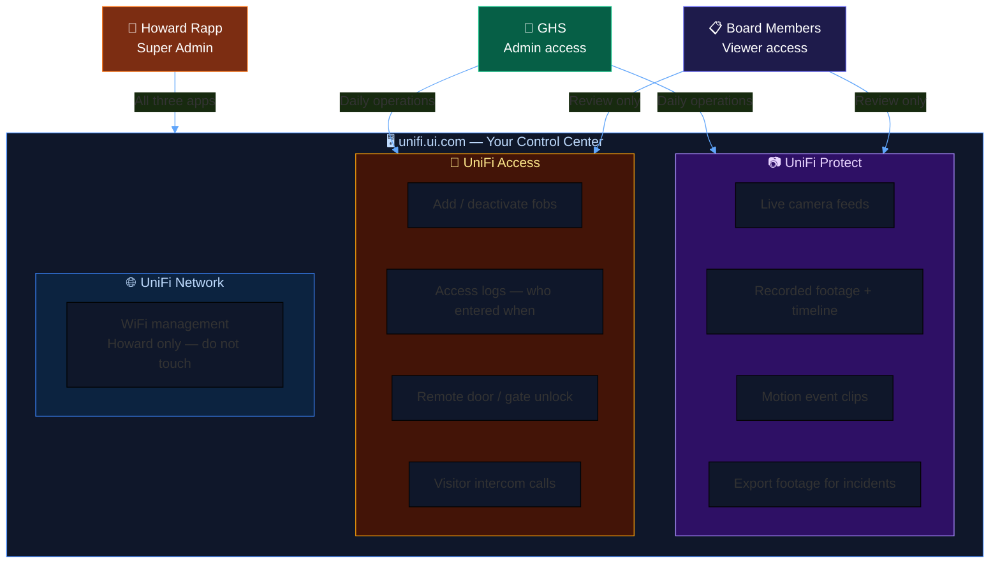

---

## Section 1 — Logging In

**Web address:** `https://unifi.ui.com`

Your login is your email address plus the password Howard set up for your account.

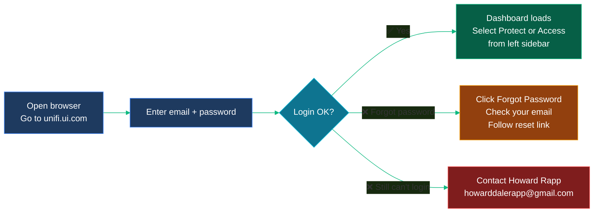

> GHS (Sharon and Kevin) have **Admin** access — view cameras, manage fobs, unlock doors.
> Board members have **Viewer** access — view cameras and access logs only, no changes.

---

## Section 2 — Watching Live Cameras

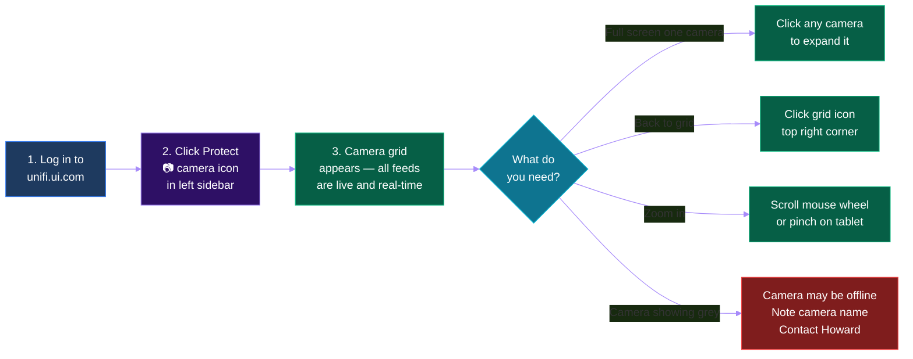

---

## Section 3 — Reviewing Recorded Footage

> ⚠️ **Critical:** Footage is kept for approximately **30 days only**. Export any footage needed for incidents before the window closes — it cannot be recovered once overwritten.

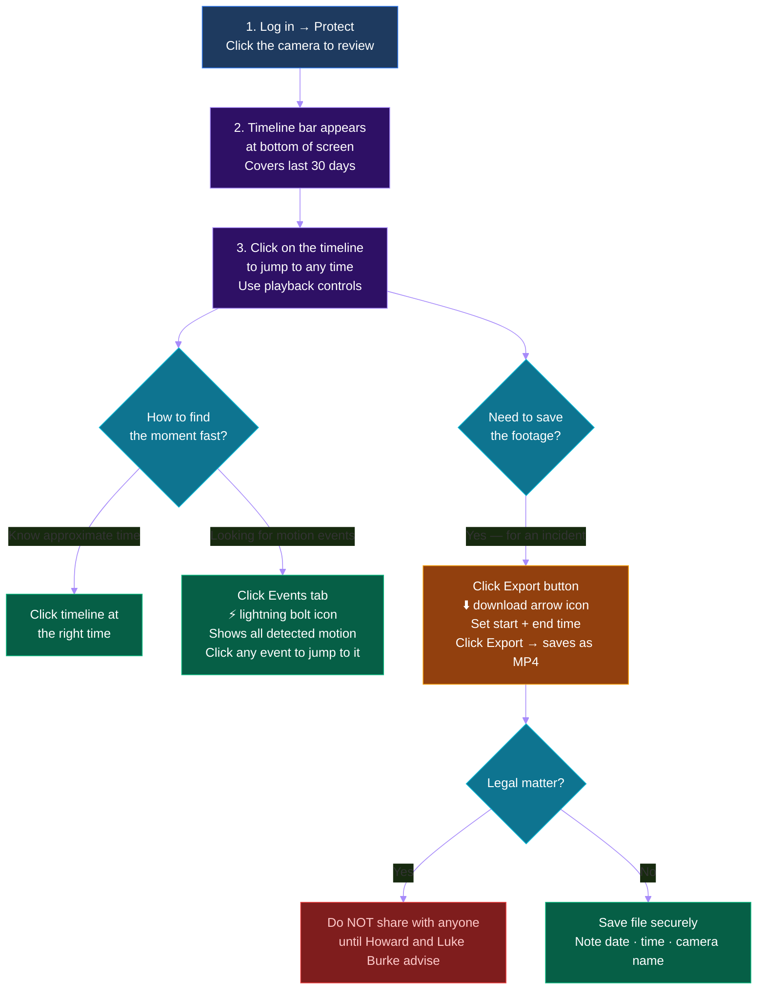

---

## Section 4 — Adding a New Resident's Fob

**You need first:** Resident name, lot address, and the fob number (printed on the back of the fob, usually 8-10 digits).

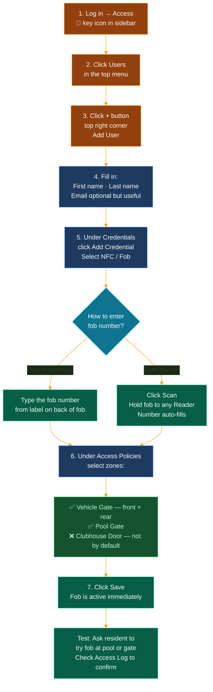

---

## Section 5 — Deactivating a Fob

> ⚠️ **Do this immediately** when a resident moves out, reports a fob lost or stolen, or a fob is not returned. A deactivated fob grants zero access even if someone still has the physical fob.

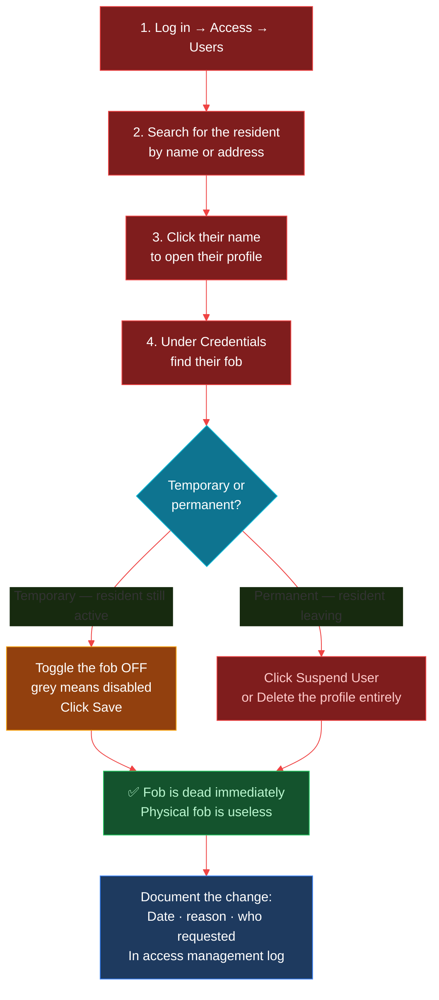

---

## Section 6 — Letting a Visitor in Through the Front Gate

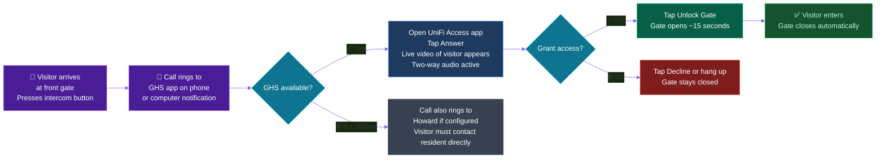

> The rear gate has no intercom. Rear gate is for credentialed residents and service vehicles with fobs only.

---

## Section 7 — Unlocking a Door or Gate Remotely

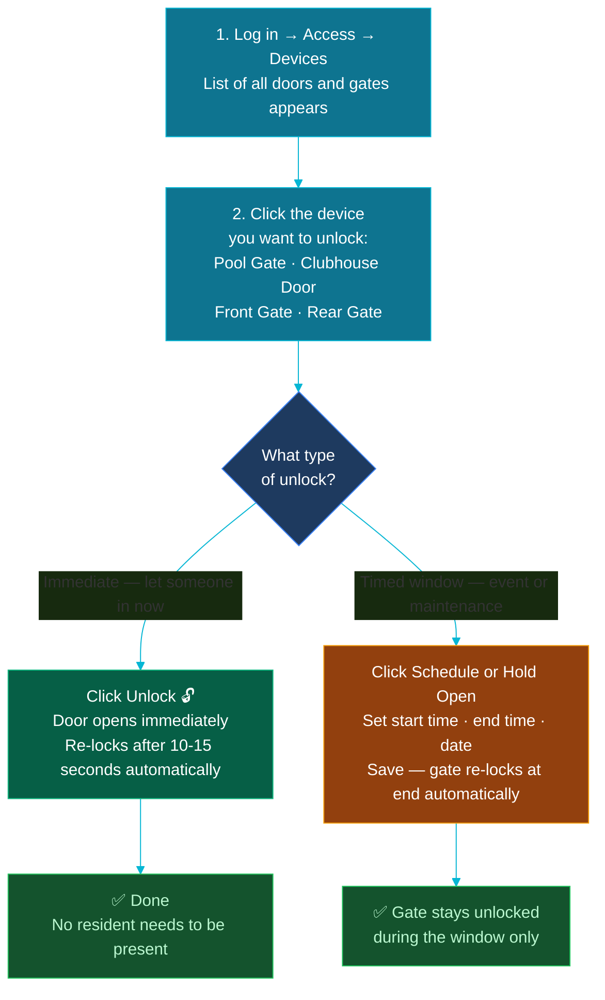

---

## Section 8 — Resident Can't Get In (Troubleshooting)

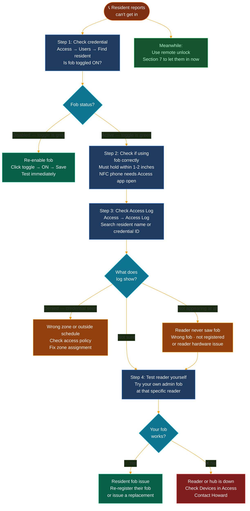

---

## Section 9 — Something Is Broken

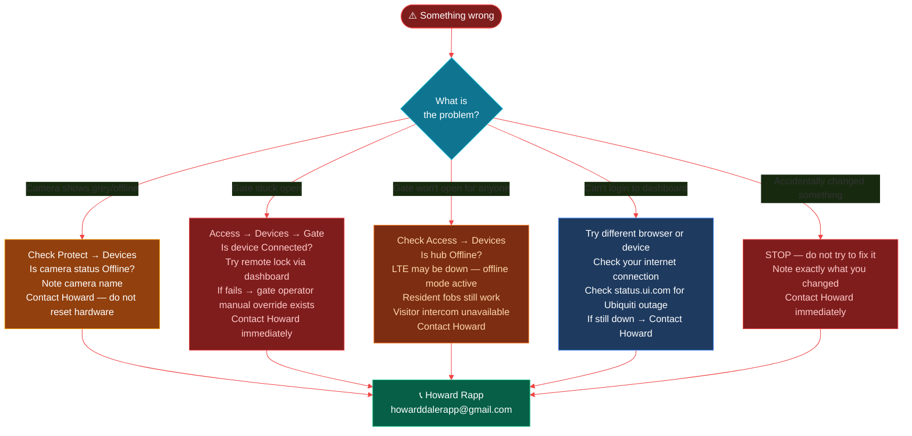

---

## Section 10 — Who to Call for What

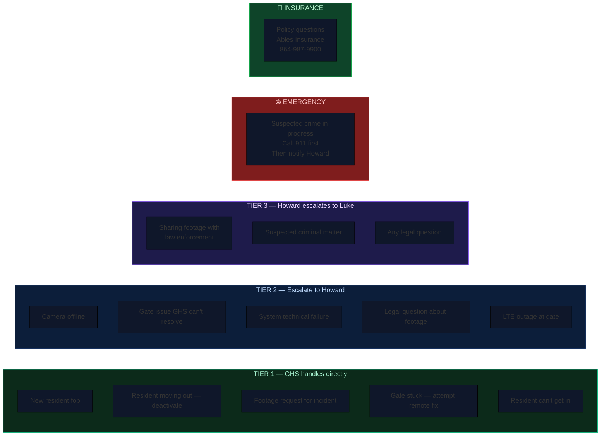

| Contact | Role | How to reach |
|---|---|---|
| Howard Rapp | System owner / technical | howarddalerapp@gmail.com |
| GHS | Operations | support@greenvillehoa.com · 864-213-2156 |
| Luke Burke | HOA attorney | lburke@gvlattorney.com |
| Ables Insurance | E&O/D&O policy | 864-987-9900 |

---

## Section 11 — Monthly Routine (GHS)

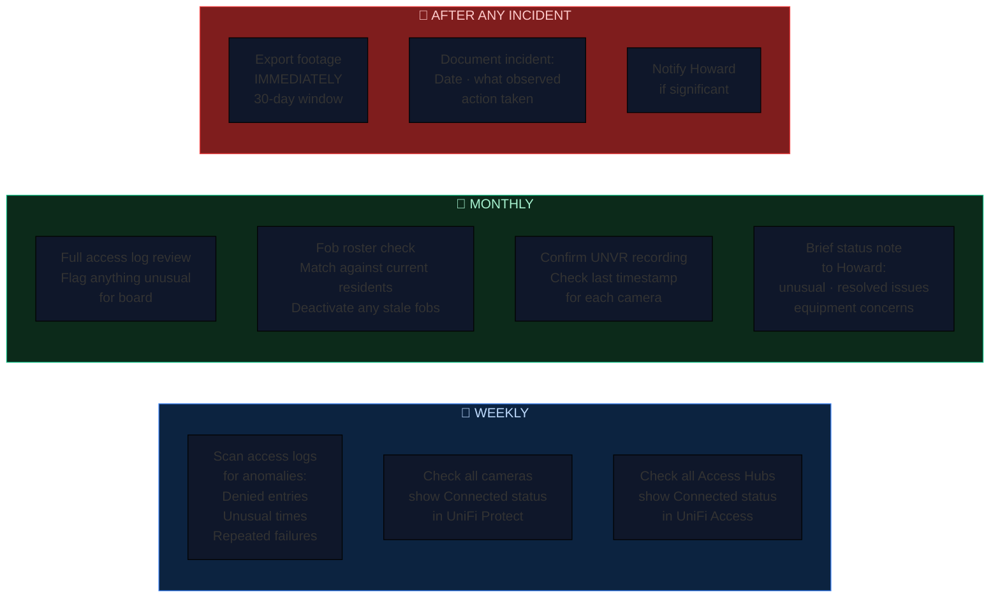

---

## Section 12 — What Each Device Does (Plain Language)

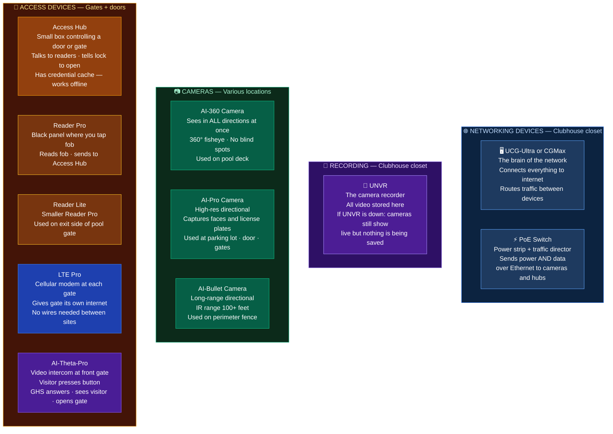

---

*Project ARGUS | River Shoals HOA*
*Questions: GHS at support@greenvillehoa.com or Howard Rapp at howarddalerapp@gmail.com*
*Last updated: June 2026*
