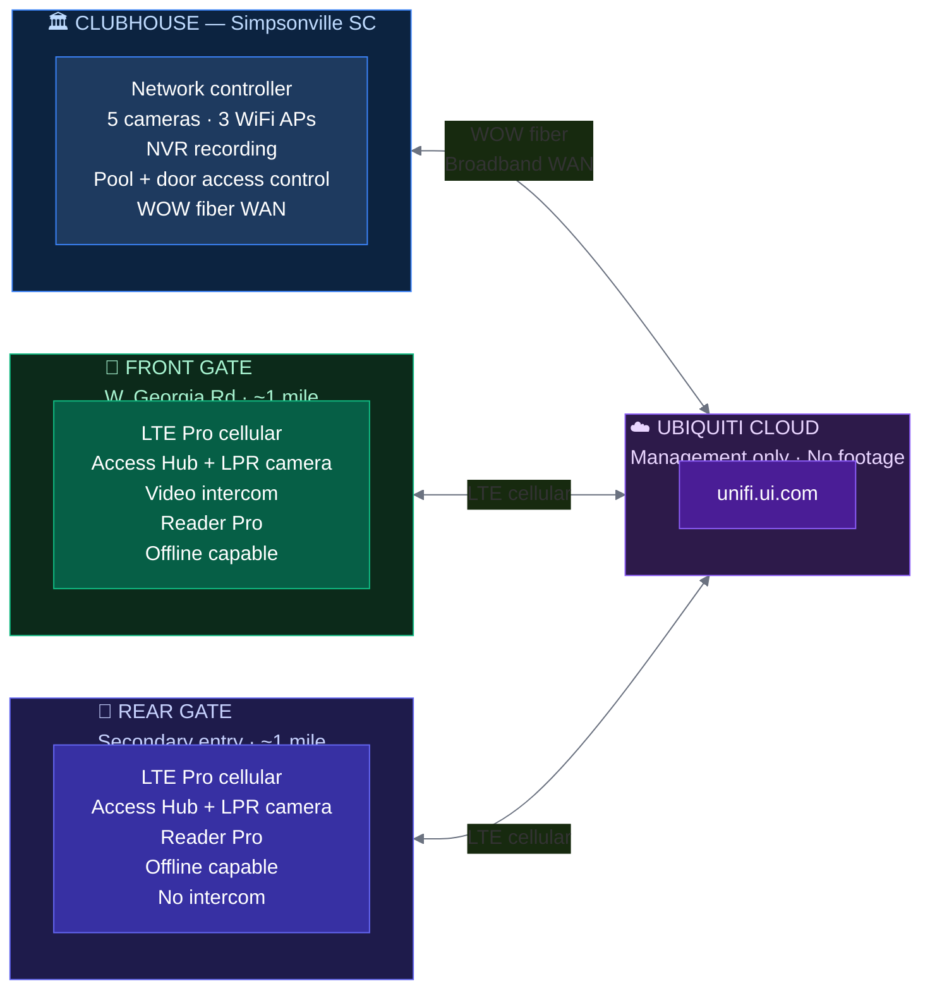
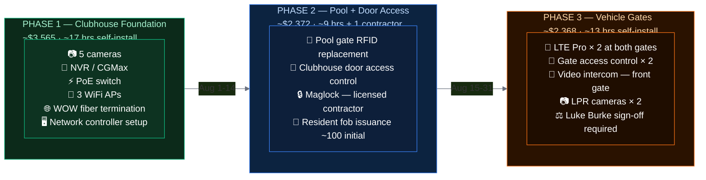
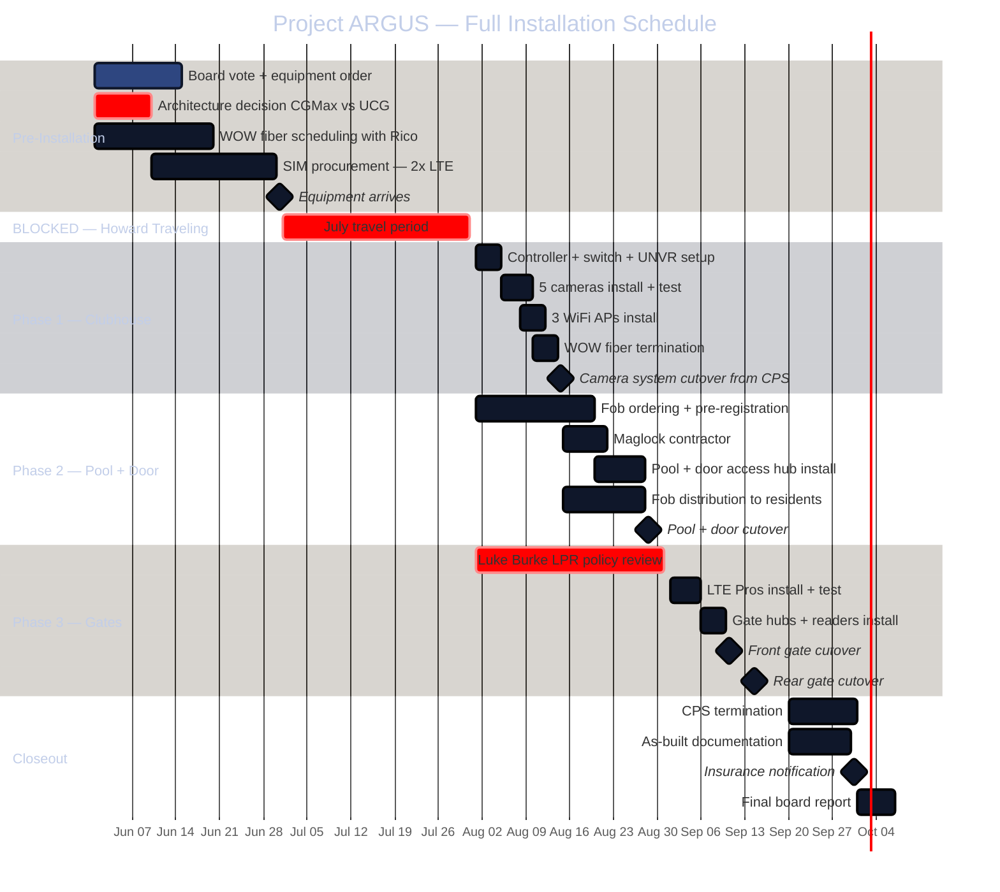
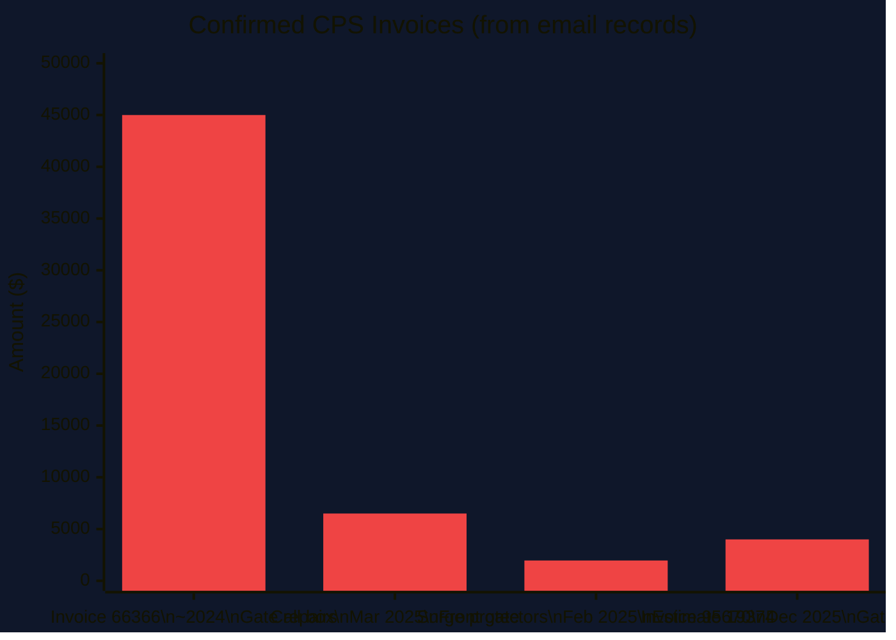
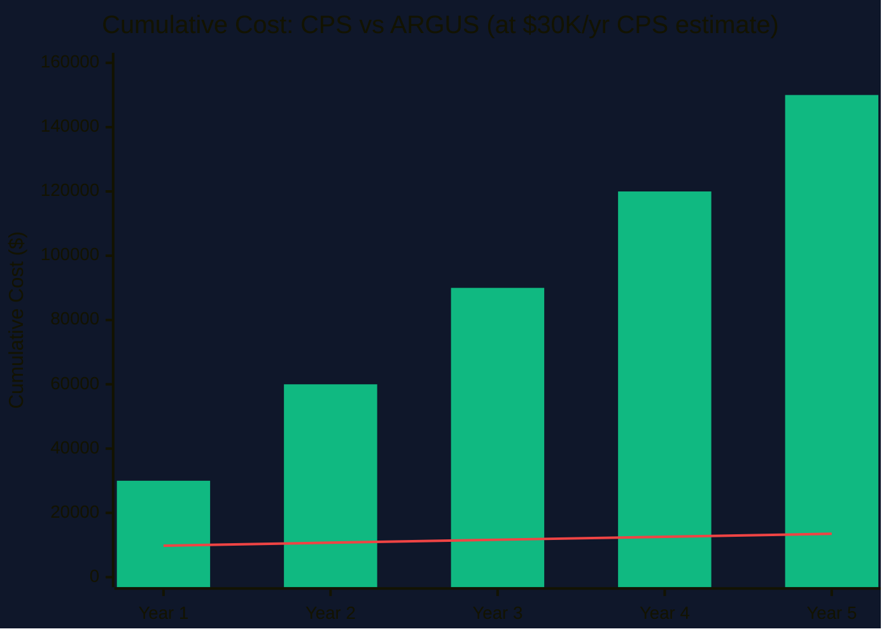
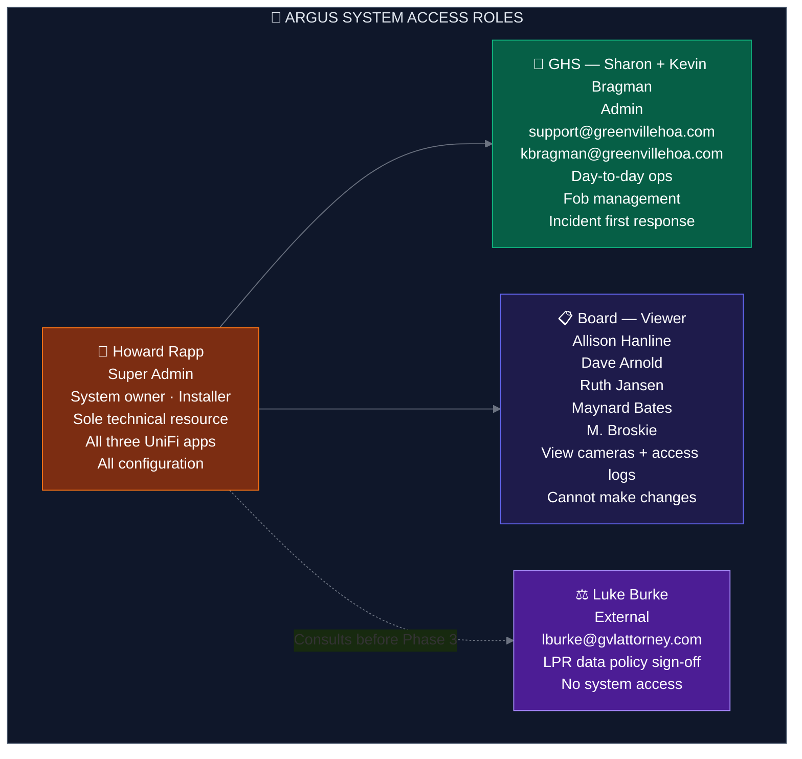
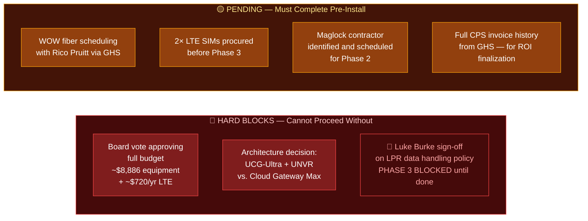

# Project ARGUS
## River Shoals HOA — Security Infrastructure Modernization

> **Project name:** In Greek myth, Argus Panoptes was a giant with a hundred eyes — the ever-watchful guardian who never slept. The name fits a project whose purpose is community-wide visibility and access control across the clubhouse, pool, and both gates — all owned and managed by the board itself.

---

## Document Index

| Document | Purpose |
|---|---|
| **ARGUS_Project_Plan.md** (this file) | Executive summary, phases, schedule, ROI |
| **ARGUS_Tracker.md** | Budget line items, equipment list, open items, decisions log |
| **ARGUS_Network_Architecture.md** | Network diagrams, VLAN design, IP plan, camera placement |
| **ARGUS_Security_Plan.md** | Defense-in-depth security framework, policies, compliance |
| **ARGUS_Operations_Guide.md** | Plain-language how-to for GHS and board members |
| **ARGUS_Transition_Plan.md** | Zero-downtime CPS to ARGUS cutover plan |

---

## 1. Three-Site Overview

---

## 2. Project Summary

| Field | Detail |
|---|---|
| Community | River Shoals HOA, Simpsonville SC — 280+ lots |
| Objective | Replace CPS vendor-managed security with board-owned Ubiquiti UniFi |
| Equipment Budget | ~$8,305 before SC sales tax (~$8,886 with tax at 7%) |
| Ongoing Operating Cost | ~$50-70/month for 2× LTE SIM plans at gates |
| Installation Lead | Howard Rapp — operates identical UniFi system at personal residence |
| Outside Labor | One licensed contractor for clubhouse door maglock only |
| WOW Fiber | Available at clubhouse at no install cost — coordinate with Rico Pruitt via GHS |
| Hands-on Start | Early August 2026 (deferred until after July travel) |
| Attorney Hard Block | Luke Burke review of LPR data handling policy required before Phase 3 |

---

## 3. Three Phases

---

## 4. Full Project Schedule

---

## 5. ROI Analysis

### Known CPS Costs from Email Records

| Date | Invoice | Amount | Description |
|---|---|---|---|
| ~2024 | Invoice 66366 | **$45,000** | Gate repairs — loop work (2024/2025) |
| Feb 2025 | Estimate 19374 | **$1,962** | Surge protectors |
| Mar 2025 | Board approval | **$6,500** | Front gate call box replacement |
| Dec 2025 | Invoice 95670 | **$4,000** | Gate repairs |
| Mar 2025 | Keypad invoice | **TBD** | Front gate keypad |
| Various | Camera work | **TBD** | $750/camera replacement rate |

**Confirmed minimum from email records: $57,462 over ~24 months**

> GHS has been asked to pull complete CPS invoice history from CINC to establish the full annual figure.

### ARGUS vs CPS — Break-Even Analysis

| Annual CPS Savings Estimate | Break-Even Point |
|---|---|
| $20,000/year | ~5.4 months |
| $30,000/year | ~3.6 months |
| $40,000/year | ~2.7 months |

**ARGUS annual operating cost:** ~$920/year (LTE SIMs + consumables)
**ARGUS one-time equipment:** ~$8,886 with SC tax

The $45,000 single gate repair invoice alone exceeds the entire ARGUS equipment budget.

---

## 6. System Access and Roles

---

## 7. Critical Prerequisites — Nothing Moves Without These

---

## 8. Key Contacts

| Role | Name | Contact |
|---|---|---|
| System Owner / Installer | Howard Rapp | howarddalerapp@gmail.com |
| WOW Fiber | Rico Pruitt (via GHS) | support@greenvillehoa.com |
| HOA Attorney | Luke Burke | lburke@gvlattorney.com |
| Property Management | Sharon / Kevin Bragman | support@greenvillehoa.com · kbragman@greenvillehoa.com |
| Insurance | Ables Insurance | 864-987-9900 |
| CPS (current vendor) | AR department | AR@cpsgreenville.com |

---

*Project ARGUS | River Shoals HOA | Confidential Board Document*
*Last updated: June 2026*
