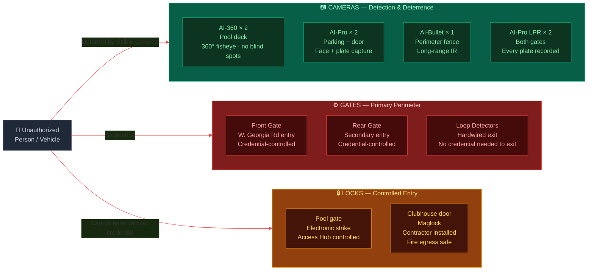
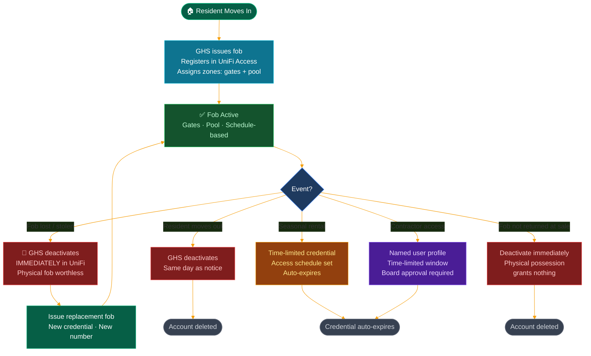
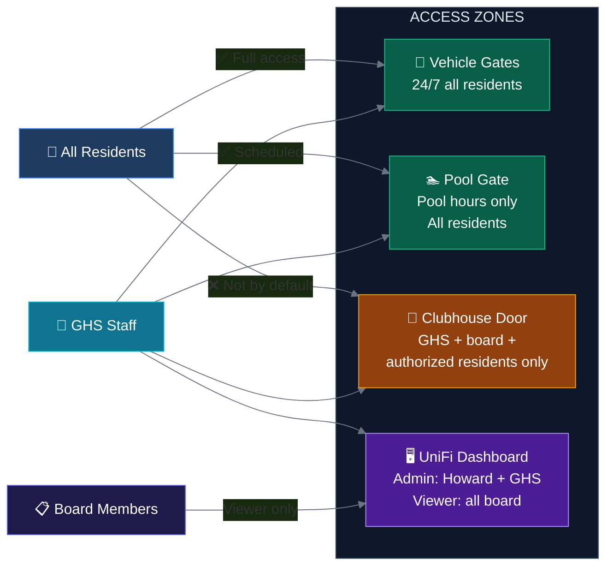
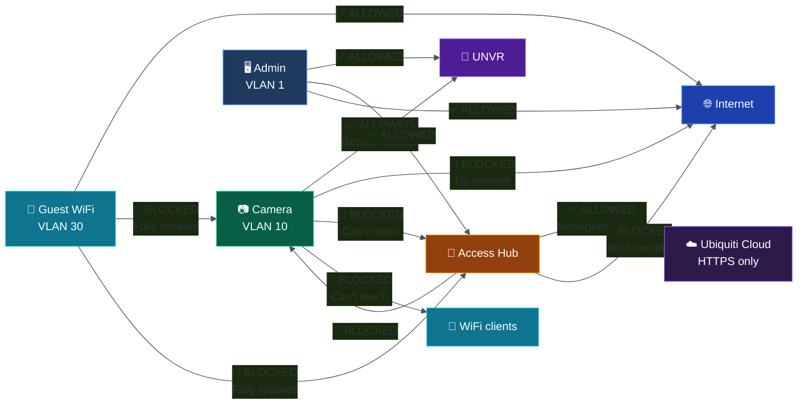
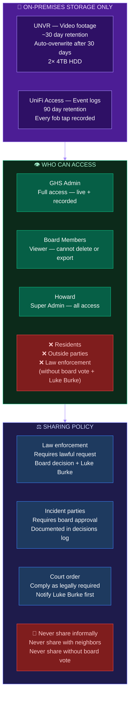
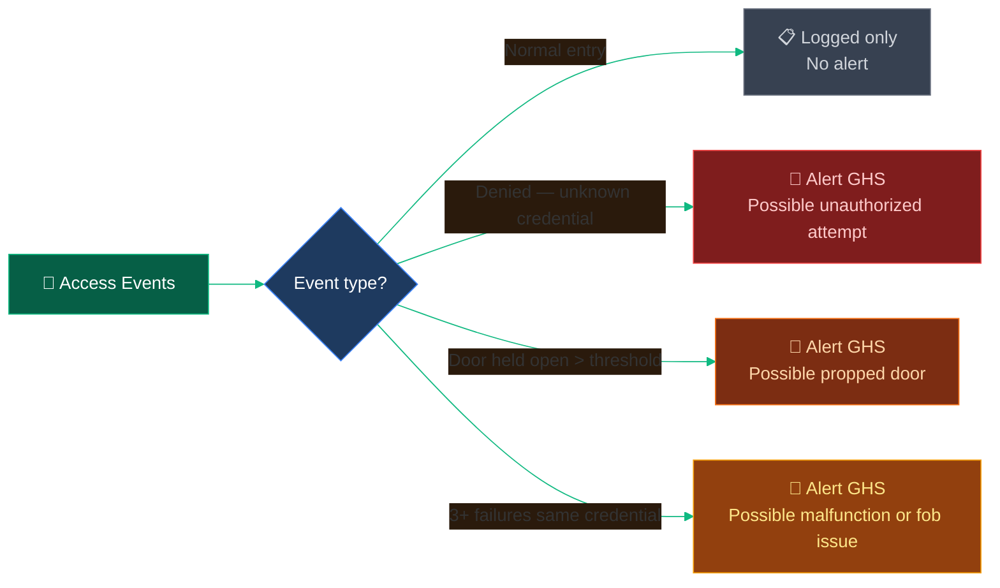
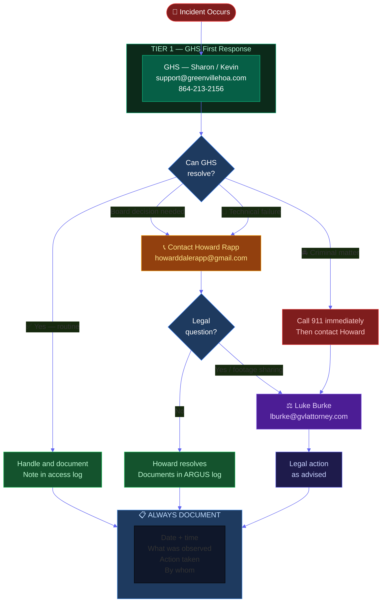
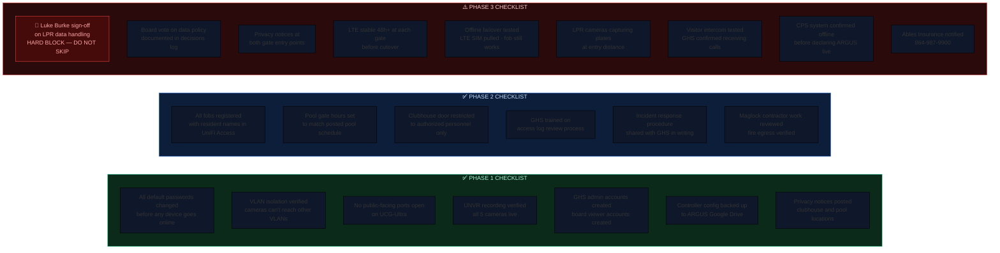

# Project ARGUS — Security Plan
## River Shoals HOA | Defense-in-Depth Framework

*Last updated: June 2026 | Owner: Howard Rapp*

> **Defense in depth** means no single point of failure protects the community. Security is layered — physical, electronic, procedural, and legal — so that if any one layer is bypassed or fails, others remain intact.

---

## 1. The Eight Layers of Defense

```mermaid
%%{init: {'theme': 'base', 'themeVariables': {'primaryColor': '#0f172a', 'lineColor': '#475569'}}}%%
graph BT
    L0["🔒 LAYER 0 — PHYSICAL SECURITY\nGates · Cameras · Lighting · Locks\nVisible deterrence and perimeter control"]
    L1["🪪 LAYER 1 — ACCESS CONTROL\nFob lifecycle · Least privilege · Schedules\nCredentialed entry only — no tailgating"]
    L2["🌐 LAYER 2 — NETWORK SECURITY\nVLAN segmentation · Firewall rules\nCameras isolated · No open ports"]
    L3["💾 LAYER 3 — DATA SECURITY\nOn-premises UNVR only · 30-day retention\nAccess logs 90 days · Footage policy"]
    L4["🔍 LAYER 4 — MONITORING & DETECTION\nAI motion alerts · Smart detection zones\nAnomaly response · After-hours alerts"]
    L5["🚨 LAYER 5 — INCIDENT RESPONSE\nEscalation paths · GHS first response\nHoward technical · Luke Burke legal"]
    L6["📋 LAYER 6 — AUDIT & ACCOUNTABILITY\nFull access logs · Board oversight\nAnnual review · Separation of duties"]
    L7["⚖️ LAYER 7 — LEGAL & COMPLIANCE\nAttorney review · Privacy notices\nLPR data policy · Insurance notification"]

    L0 --> L1 --> L2 --> L3 --> L4 --> L5 --> L6 --> L7

    style L0 fill:#7f1d1d,stroke:#ef4444,color:#fecaca
    style L1 fill:#7c2d12,stroke:#f97316,color:#fed7aa
    style L2 fill:#713f12,stroke:#eab308,color:#fef08a
    style L3 fill:#14532d,stroke:#22c55e,color:#bbf7d0
    style L4 fill:#0c4a6e,stroke:#0ea5e9,color:#bae6fd
    style L5 fill:#1e1b4b,stroke:#6366f1,color:#c7d2fe
    style L6 fill:#4a1d96,stroke:#a855f7,color:#e9d5ff
    style L7 fill:#500724,stroke:#ec4899,color:#fbcfe8
```

---

## 2. Layer 0: Physical Security

---

## 3. Layer 1: Access Control — Credential Lifecycle

**Least privilege by zone:**

---

## 4. Layer 2: Network Security — Firewall Rules

---

## 5. Layer 3: Data Security

---

## 6. Layer 4: Monitoring — Smart Alert Configuration

| Camera | Alert Trigger | Hours | Recipient |
|---|---|---|---|
| AI-360 Pool North | Person detected | After pool hours | GHS via app |
| AI-360 Pool South | Person detected | After pool hours | GHS via app |
| AI-Pro Parking | Vehicle detected | After midnight | GHS via app |
| AI-Pro Clubhouse Door | Person at door | After business hours | GHS via app |
| AI-Bullet Perimeter | Person detected | Any time | GHS via app |
| AI-Pro Front Gate LPR | Always recording | Always | No alert — review on demand |
| AI-Pro Rear Gate LPR | Always recording | Always | No alert — review on demand |

**Gate access alerts — configure in UniFi Access:**

---

## 7. Layer 5: Incident Response — Escalation Path

**Common incident quick reference:**

| Incident | Immediate Response |
|---|---|
| Pool break-in / vandalism | GHS exports footage, notifies Howard. Howard contacts police if appropriate, Luke Burke if legal questions. |
| Gate stuck open | GHS attempts remote lock via dashboard. If fails, dispatch on-site. Contact Howard. |
| Unauthorized person in pool | Review footage. If pattern, trespass notice via Luke Burke. |
| Lost or stolen fob | GHS deactivates immediately in UniFi Access. Zero delay. |
| LTE outage at gate | Gates continue operating (offline mode). Visitor intercom unavailable. Howard investigates. |
| System compromise suspected | Change all admin passwords immediately. Review access logs. Notify Howard. Consult Luke Burke if data exposure possible. |

---

## 8. Layers 6 and 7: Audit, Accountability, and Legal

```mermaid
%%{init: {'theme': 'base', 'themeVariables': {'primaryColor': '#0f172a', 'lineColor': '#a855f7'}}}%%
graph LR
    subgraph DUTIES["SEPARATION OF DUTIES"]
        OP["🏢 GHS\nOperational layer\nResidents + credentials\nDay-to-day ops"]
        TECH["👤 Howard\nTechnical layer\nSystem config + security policy\nNo GHS config changes without approval"]
        GOV["📋 Board\nGovernance layer\nPolicy approval\nIncident review"]
        LEGAL2["⚖️ Luke Burke\nLegal layer\nData policy review\nLPR sign-off\nFootage sharing guidance"]
    end

    OP <-->|"Operations reports"| GOV
    TECH <-->|"Technical reports"| GOV
    TECH -->|"Policy questions"| LEGAL2
    GOV -->|"Directs"| OP
    GOV -->|"Directs"| TECH

    subgraph REQUIRED["⚠️ HARD REQUIREMENTS"]
        R1["Luke Burke review of LPR\ndata handling policy\nREQUIRED before Phase 3 go-live"]
        R2["Privacy notices posted\nat all camera locations\nbefore any system is live"]
        R3["Board vote to adopt\ndata handling policy\ndocumented in decisions log"]
        R4["Ables Insurance notified\nafter Phase 1 completion\n864-987-9900"]
    end

    LEGAL2 --> REQUIRED

    style DUTIES fill:#0f172a,stroke:#475569,color:#e2e8f0
    style OP fill:#065f46,stroke:#10b981,color:#fff
    style TECH fill:#1e3a5f,stroke:#3b82f6,color:#fff
    style GOV fill:#4c1d95,stroke:#a78bfa,color:#fff
    style LEGAL2 fill:#500724,stroke:#ec4899,color:#fff
    style REQUIRED fill:#7f1d1d,stroke:#ef4444,color:#fecaca
    style R1 fill:#450a0a,stroke:#ef4444,color:#fca5a5
    style R2 fill:#450a0a,stroke:#ef4444,color:#fca5a5
    style R3 fill:#450a0a,stroke:#ef4444,color:#fca5a5
    style R4 fill:#450a0a,stroke:#ef4444,color:#fca5a5
```

---

## 9. Phase-by-Phase Security Checklists

---

*Project ARGUS | River Shoals HOA | Confidential Board Document*
*Last updated: June 2026*
