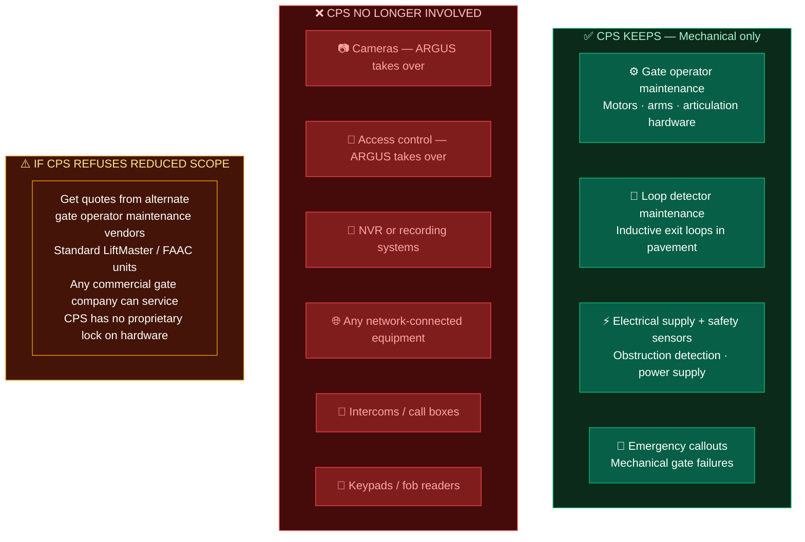
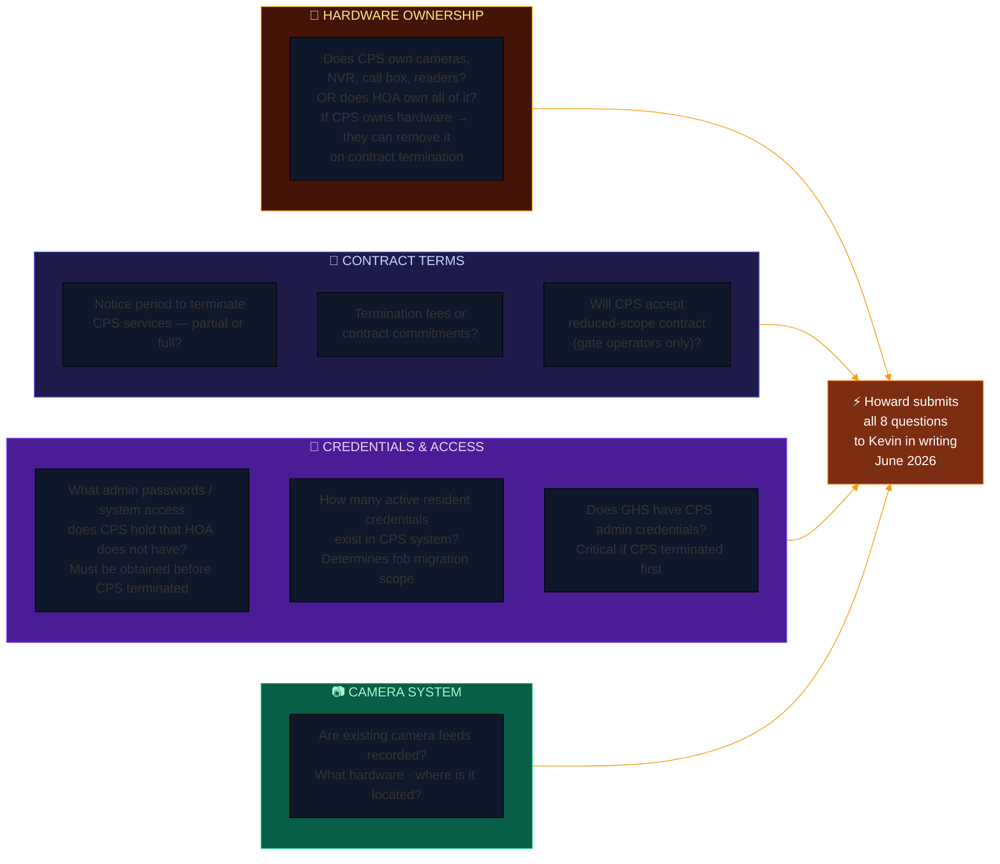
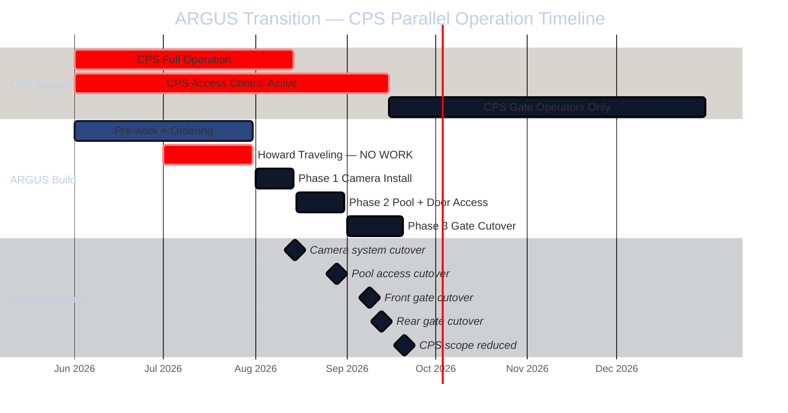
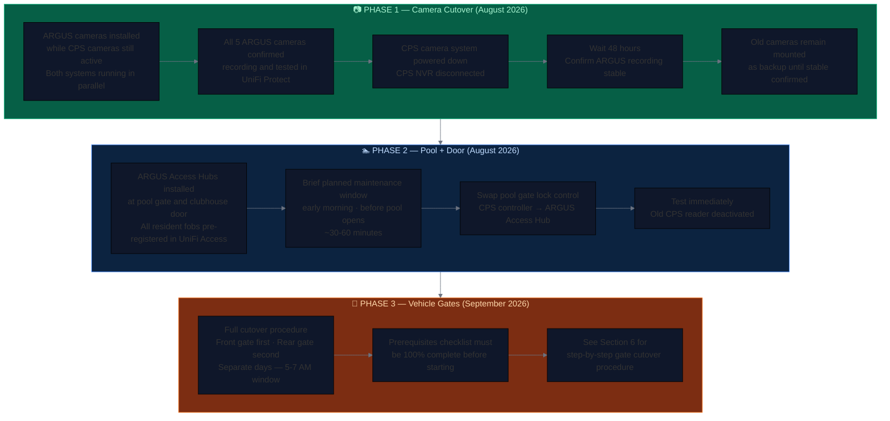
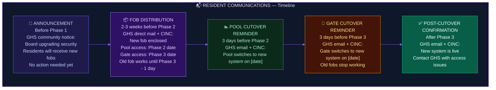

# Project ARGUS — Transition Plan
## River Shoals HOA | CPS to ARGUS Cutover with Zero Service Interruption

*Last updated: June 2026 | Owner: Howard Rapp*

> **Goal:** Replace CPS-managed cameras and access control with board-owned ARGUS infrastructure. No resident is ever locked out. No gate is ever left uncontrolled. No camera coverage lapses during the transition.

---

## 1. The Transition at a Glance

```mermaid
%%{init: {'theme': 'base', 'themeVariables': {'primaryColor': '#0f172a', 'lineColor': '#6b7280'}}}%%
graph LR
    subgraph NOW["🔴 TODAY — CPS Controls Everything"]
        NC1["📷 Cameras\nCPS managed NVR"]
        NC2["🔑 Gate access control\nCPS call box + keypads"]
        NC3["⚙️ Gate operators\nCPS maintains"]
        NC4["🏊 Pool + door access\nCPS managed"]
    end

    subgraph FUTURE["🟢 AFTER ARGUS — Board Owns Security"]
        FC1["📷 Cameras\nBoard-owned UNVR · UniFi Protect"]
        FC2["🔑 Gate access control\nBoard-owned UniFi Access · LTE Pros"]
        FC3["⚙️ Gate operators\nCPS continues — mechanical only"]
        FC4["🏊 Pool + door access\nBoard-owned UniFi Access · Hubs"]
    end

    NOW -->|"Phased cutover\nAug–Sep 2026\nZero downtime"| FUTURE

    style NOW fill:#450a0a,stroke:#ef4444,color:#fecaca
    style FUTURE fill:#0c2a1a,stroke:#10b981,color:#a7f3d0
    style NC1 fill:#7f1d1d,stroke:#ef4444,color:#fff
    style NC2 fill:#7f1d1d,stroke:#ef4444,color:#fff
    style NC3 fill:#374151,stroke:#9ca3af,color:#fff
    style NC4 fill:#7f1d1d,stroke:#ef4444,color:#fff
    style FC1 fill:#065f46,stroke:#10b981,color:#fff
    style FC2 fill:#065f46,stroke:#10b981,color:#fff
    style FC3 fill:#374151,stroke:#9ca3af,color:#d1d5db
    style FC4 fill:#065f46,stroke:#10b981,color:#fff
```

---

## 2. Post-Transition CPS Scope

---

## 3. Open Questions — Must Resolve Before Planning

---

## 4. Parallel Operation Strategy — Zero Downtime

**The key principle: Build ARGUS alongside CPS, test thoroughly, then cut over one system at a time.**

---

## 5. Phase-by-Phase Cutover Detail

---

## 6. Credential Migration — Fob Transition

```mermaid
%%{init: {'theme': 'base', 'themeVariables': {'primaryColor': '#0f172a', 'lineColor': '#f59e0b'}}}%%
flowchart LR
    subgraph BEFORE["BEFORE CUTOVER"]
        B1["Every resident has\nOLD CPS credential\n(fob or keycode)\nWorks at CPS system"]
        B2["Howard orders\n300 ARGUS fobs\n6 weeks before Phase 2"]
        B3["GHS pre-registers\nall fobs in UniFi Access\n3-4 weeks before Phase 2"]
        B4["GHS distributes\nnew ARGUS fobs\nto all residents\nWith instruction letter"]
    end

    subgraph OVERLAP["OVERLAP PERIOD — Both work"]
        O1["Resident has:\n✅ OLD fob — works at CPS\n✅ NEW fob — registered in ARGUS\nbut gates not switched yet"]
    end

    subgraph CUTOVER2["ON CUTOVER DAY"]
        C1["ARGUS Access Hub\nconnected to gate operator"]
        C2["CPS controller\ndisconnected from gate operator"]
        C3["From this moment:\nARGUS fob works\nCPS fob does nothing"]
    end

    BEFORE --> OVERLAP --> CUTOVER2

    style BEFORE fill:#1e3a5f,stroke:#3b82f6,color:#bfdbfe
    style OVERLAP fill:#431407,stroke:#f59e0b,color:#fde68a
    style CUTOVER2 fill:#0c2a1a,stroke:#10b981,color:#a7f3d0
    style B1 fill:#0f2744,stroke:#3b82f6,color:#fff
    style B2 fill:#0f2744,stroke:#3b82f6,color:#fff
    style B3 fill:#0f2744,stroke:#3b82f6,color:#fff
    style B4 fill:#0f2744,stroke:#3b82f6,color:#fff
    style O1 fill:#431407,stroke:#f59e0b,color:#fff
    style C1 fill:#065f46,stroke:#10b981,color:#fff
    style C2 fill:#7f1d1d,stroke:#ef4444,color:#fff
    style C3 fill:#14532d,stroke:#22c55e,color:#bbf7d0
```

> **Do not tell residents the old fob will stop working until 1-2 days before Phase 3 cutover.** If the notice goes out too early, residents will discard working fobs before ARGUS is live.

---

## 7. Gate Cutover Procedure — Step by Step

Performed at each gate separately. Front gate first. Verify fully. Then rear gate on a separate day.

### Prerequisites — All Must Be Complete Before Starting

```mermaid
%%{init: {'theme': 'base', 'themeVariables': {'primaryColor': '#0f172a', 'lineColor': '#10b981'}}}%%
graph LR
    subgraph PRE["⚠️ GATE CUTOVER PREREQUISITES — ALL REQUIRED"]
        PR1["☐ All resident fobs\nissued + registered in UniFi Access"]
        PR2["☐ LTE Pro stable 48h+\nat this gate"]
        PR3["☐ Access Hub confirmed\nreceiving credential syncs"]
        PR4["☐ OFFLINE MODE TESTED:\nPull LTE SIM → fob still works\nRe-insert SIM"]
        PR5["☐ LPR camera confirmed\ncapturing plates at entry distance"]
        PR6["☐ Visitor intercom tested\nGHS confirms receiving calls\n(front gate only)"]
        PR7["☐ Gate operator dry contact\nwiring from Hub confirmed correct"]
        PR8["☐ 🔴 HARD BLOCK:\nLuke Burke LPR data policy\nsign-off obtained + documented"]
        PR9["☐ Resident notice sent"]
        PR10["☐ GHS on standby\nduring cutover window"]
    end

    style PRE fill:#431407,stroke:#f97316,color:#fde68a
    style PR8 fill:#450a0a,stroke:#ef4444,color:#fca5a5
```

### Cutover Steps — 5:00 AM to 7:00 AM Window

```mermaid
%%{init: {'theme': 'base', 'themeVariables': {'primaryColor': '#0f172a', 'lineColor': '#06b6d4'}}}%%
flowchart TD
    PRE2(["✅ All prerequisites\nchecked off"]) --> ST1

    ST1["STEP 1 — 30 min before window\nLog into UniFi Access\nConfirm gate device shows Online\nConfirm all credentials synced\nTest admin remote unlock — gate responds"]

    ST2["STEP 2 — Open gate operator cabinet\nLocate CPS access control module\nDo NOT disconnect yet\n📸 Photo current wiring configuration"]

    ST3["STEP 3 — Document CPS state\nNote all active codes and fob IDs\nConfirm all non-resident credentials\n(vendors, landscapers) are documented\nfor re-entry in ARGUS"]

    ST4["STEP 4 — Disconnect CPS controller\nDisconnect CPS output wires\nfrom gate operator dry contact\nLeave CPS unit physically in place\nGate is now in fail-secure — opens for no one"]

    ST5["STEP 5 — Connect ARGUS Access Hub\nConnect UA-Hub relay output wires\nto gate operator dry contact terminals\n(same position as CPS was using)"]

    ST6["STEP 6 — Test ARGUS gate operation\nTest 1: Resident fob → gate opens\nTest 2: Admin remote unlock → gate opens\nTest 3: Loop detector exit → gate closes\nTest 4: Pull LTE SIM → fob still opens (offline)\nReinsert SIM"]

    ST7{"All 4 tests\npassed?"}

    ST8["✅ STEP 7 — Declare cutover complete\nLog time in ARGUS Decisions Log\nLeave CPS controller in place\n30-day safety net before physical removal"]

    ROLLBACK["🚨 ROLLBACK\nReconnect CPS controller\nto gate operator dry contact\nCPS resumes control\nNotify Howard immediately\nDo not reattempt until issue resolved"]

    ST1 --> ST2 --> ST3 --> ST4 --> ST5 --> ST6 --> ST7
    ST7 -->|"✅ Yes"| ST8
    ST7 -->|"❌ No"| ROLLBACK

    ST8 --> MONITOR["STEP 8 — Monitor 48 hours\nGHS monitors access logs\nAny credential failures escalated to Howard\nGHS can admin-unlock remotely\nif a resident is stranded"]

    style PRE2 fill:#065f46,stroke:#10b981,color:#fff
    style ST1 fill:#1e3a5f,stroke:#3b82f6,color:#fff
    style ST2 fill:#1e3a5f,stroke:#3b82f6,color:#fff
    style ST3 fill:#1e3a5f,stroke:#3b82f6,color:#fff
    style ST4 fill:#7c2d12,stroke:#f97316,color:#fff
    style ST5 fill:#065f46,stroke:#10b981,color:#fff
    style ST6 fill:#0e7490,stroke:#06b6d4,color:#fff
    style ST7 fill:#0e7490,stroke:#06b6d4,color:#fff
    style ST8 fill:#14532d,stroke:#22c55e,color:#bbf7d0
    style ROLLBACK fill:#7f1d1d,stroke:#ef4444,color:#fecaca
    style MONITOR fill:#065f46,stroke:#10b981,color:#fff
```

---

## 8. Resident Communication Plan

---

## 9. Transition Open Items Tracker

| # | Item | Owner | Target | Status |
|---|---|---|---|---|
| T-1 | Submit 8 hardware/contract questions to Kevin in writing | Howard | June 2026 | Open |
| T-2 | Confirm hardware ownership — cameras, NVR, call box, readers | GHS/Kevin | June 2026 | Open |
| T-3 | Obtain CPS contract termination notice period | GHS/Kevin | June 2026 | Open |
| T-4 | Initiate CPS scope reduction conversation | Howard/GHS | July 2026 | Open |
| T-5 | Document all non-resident credentials in CPS system | GHS | Pre-Phase 2 | Open |
| T-6 | Order 300 resident fobs | Howard | 6 weeks before Phase 2 | Open |
| T-7 | GHS pre-registers all resident fobs in UniFi Access | GHS | 3-4 weeks before Phase 2 | Open |
| T-8 | Draft resident fob distribution notice | Howard/GHS | Pre-Phase 2 | Open |
| T-9 | Complete Phase 3 prerequisites checklist — both gates | Howard | Pre-Phase 3 | Open |
| T-10 | Front gate cutover executed and documented | Howard | September 2026 | Open |
| T-11 | Rear gate cutover executed and documented | Howard | September 2026 | Open |
| T-12 | CPS scope formally reduced or terminated | Howard/GHS | Post-Phase 3 | Open |
| T-13 | Alternate gate operator vendor quotes — if CPS refuses | Howard | August 2026 | Open |
| T-14 | Disconnected CPS controllers removed from cabinets | Howard | 30 days post-Phase 3 | Open |

---

*Project ARGUS | River Shoals HOA | Confidential Board Document*
*Last updated: June 2026*
